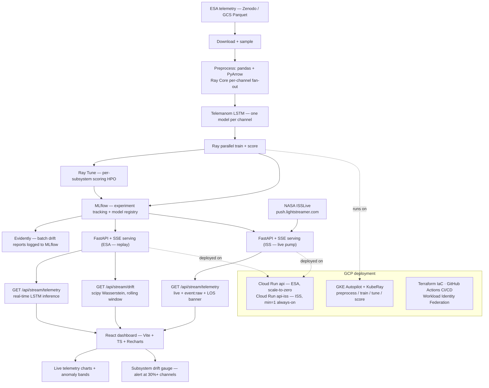
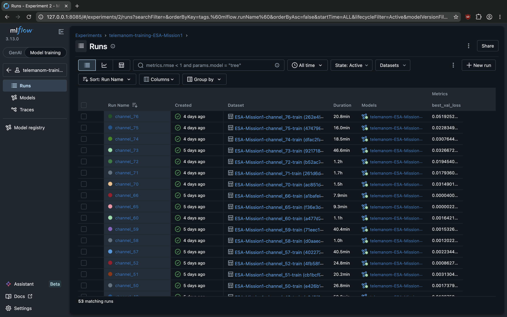
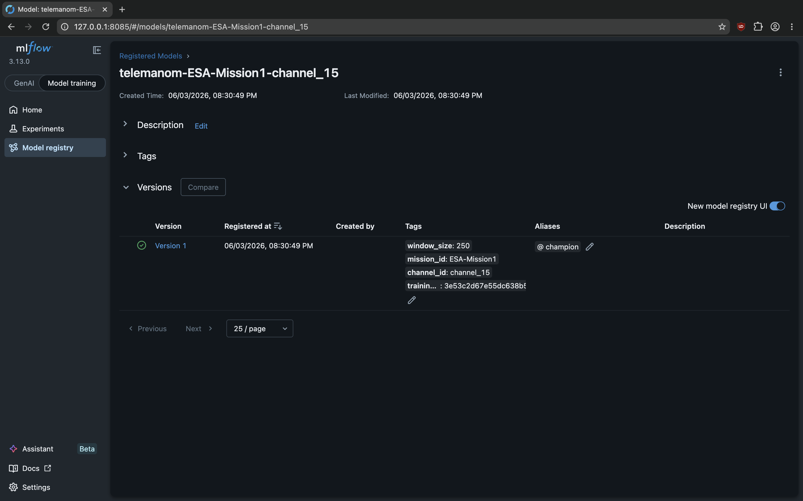
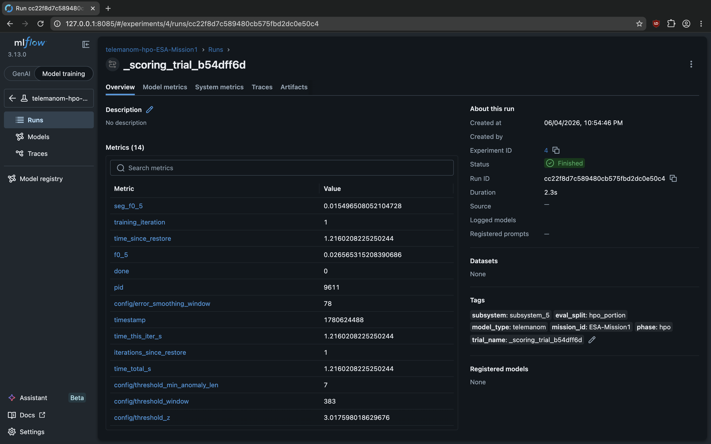
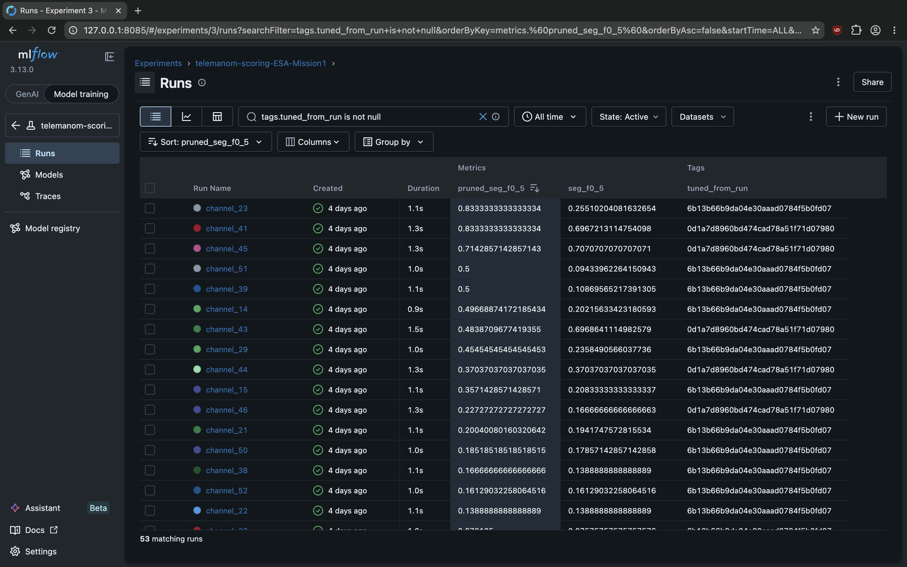
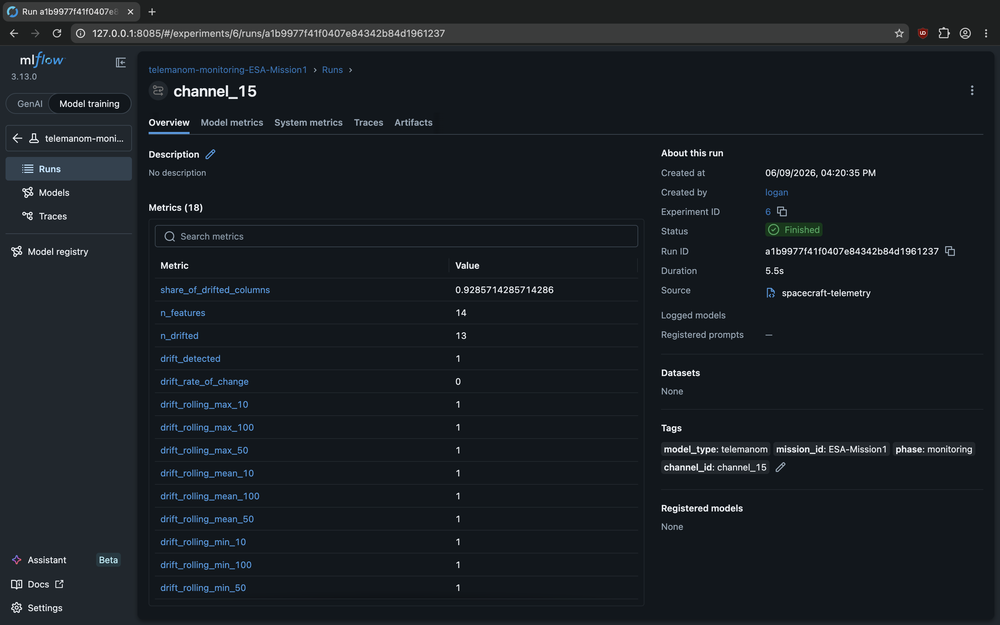
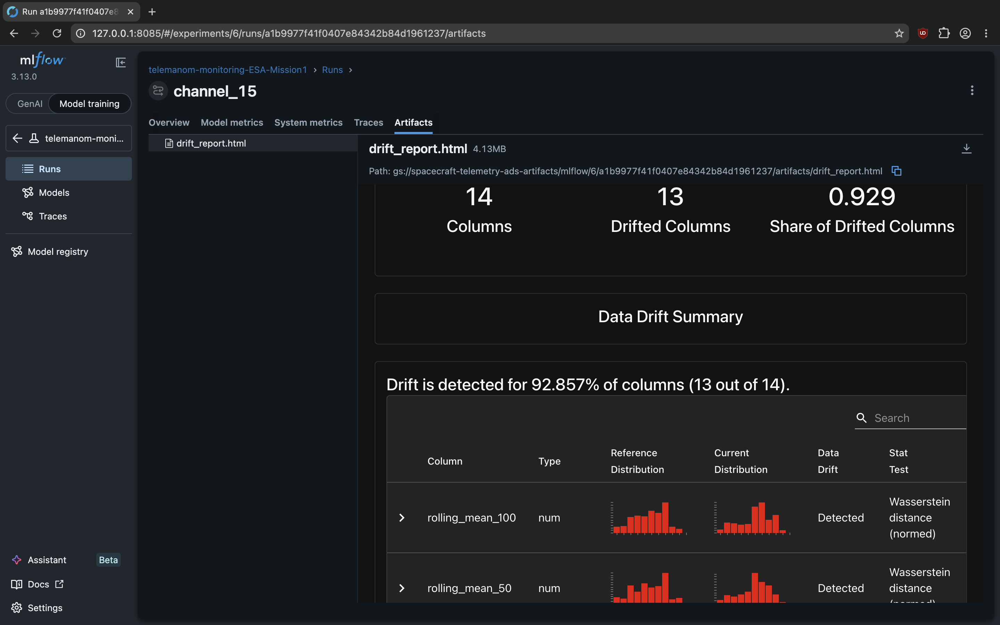

# Spacecraft Telemetry Anomaly Detection System

End-to-end MLOps platform for anomaly detection on real spacecraft telemetry, spanning
**two missions** through one mission-parameterized codebase:

- **ESA Anomaly Dataset** ([Zenodo](https://zenodo.org/records/12528696)) — 31 GB of batch
  telemetry from 3 ESA missions, ~225 channels, with **real labeled anomalies**. This is the
  interactive, quantitatively-evaluated demo.
- **NASA ISSLive** — a **live Lightstreamer feed** from the International Space Station. No
  labels exist, so detection is evaluated by **fault injection**. This showcases the platform's
  real-time path: always-on ingestion, an online inference pump, Loss-of-Signal handling, and
  live drift monitoring.

The model ([Telemanom LSTM, Hundman et al. 2018](https://arxiv.org/abs/1802.04431)) is
intentionally off-the-shelf: one small LSTM per channel trains on nominal data and flags
when sensor readings diverge from its predictions. The engineering emphasis is the platform
wrapping it — pandas + PyArrow preprocessing with Ray Core fan-out across hundreds of
channels, Ray Tune for per-subsystem HPO, MLflow for experiment tracking and model registry,
Evidently for drift monitoring, FastAPI with SSE for real-time serving, Cloud Run for
deployment, and — for ISS — a real-time Lightstreamer → asyncio pump feeding live inference.

Built as a portfolio project targeting ML Platform Engineer / ML Infrastructure roles.

**Results (ESA):** on the held-out final 40% of ESA-Mission1, anomalies are flagged in
**30 of 31** labeled channels (segment recall 0.56, precision 0.22 — see [Evaluation](#evaluation)
for the leakage-free protocol and honest framing).

**ESA live demo (interactive):** https://api-pb5fb25noa-uc.a.run.app  
*(Cloud Run scales to zero — first load may take ~2.5m if the instance has been idle: image pull + model load fan-out from GCS.)*

**ISS live pump (recorded):** the GIF below is a live capture of real ISS telemetry streaming
through the pump. The always-on ISS service (`api-iss`, `min=1`, holds an open Lightstreamer
session) is fully defined in Terraform and deployable on demand, but is kept **torn down
between demos to control the ~$60/mo always-on cost** — the code, IaC, and recording stand in
for a 24/7 endpoint. ESA stays live because it scales to zero (≈$0 idle).

**Deployment guide:** [docs/deployment.md](docs/deployment.md)

<p align="center">
  
  <br><em>ESA — interactive replay with real labeled anomalies (live at the URL above)</em>
</p>

<p align="center">
  
  <br><em>ISS — real-time NASA ISSLive feed through the live Lightstreamer pump (recorded capture)</em>
</p>


## Capabilities

- End-to-end local and cloud workflow on sampled ESA data
- Preprocessing to partitioned Parquet outputs (pandas + Ray Core fan-out per channel)
- Per-channel Telemanom training + scoring artifacts, tracked in MLflow
- Ray fan-out training and scoring across channels
- Ray Tune HPO over scoring parameters per subsystem
- MLflow experiment tracking (training, scoring, HPO experiments per mission)
- MLflow model registry with `telemanom-{mission}-{channel}` naming convention
- `mlflow promote` CLI sets the `@champion` alias on a model version (MLflow 3.x)
- Evidently batch drift detection (14 features: `value_normalized` + rolling stats)
- Drift reports (HTML) logged as MLflow artifacts; per-feature metrics logged per run
- `drift batch` CLI: build reference profile → run report → log to MLflow
- `drift batch-mission` CLI: run all channels for a mission, print summary table
- **FastAPI serving layer** (`make serve`):
  - `GET /health` — model version, uptime, loaded channels, MLflow URI
  - `GET /api/stream/telemetry` — SSE stream replaying preprocessed Parquet with
    real-time LSTM inference; per-tick anomaly scores and predicted/labeled anomaly flags
  - `?speed=N` replay speed multiplier; `?channels=ch1,ch2` channel filter
  - Structured logging with correlation IDs on every request
- **React dashboard** (`make frontend-dev`):
  - Vite + TypeScript + React 18, served at `http://localhost:5173`
  - Live per-channel time-series charts (Recharts) — value + prediction overlay
  - Ground-truth anomaly bands (red) and model-predicted bands (yellow) on each chart
  - Rising-edge anomaly alert panel with TP/FP indicator
  - Channel picker with performance warning above 5 simultaneous charts
  - Mission-control dark theme; single SSE connection multiplexed across channels
  - Real-time drift panel: per-channel scipy Wasserstein drift scores + subsystem gauge.
    Built and wired end-to-end, but **disabled by default** (`DRIFT_DISABLED = true` in
    `frontend/src/App.tsx`) because the rolling drift window never fills within a short demo
    replay. To enable: set `DRIFT_DISABLED = false`, seed reference profiles
    (`make seed-reference-profiles`), and run a longer replay. The panel also auto-hides at
    runtime when no reference profiles are available.
- Fast test, lint, and typecheck workflows
- **ISS Live telemetry (Phases 12–17):** second mission on NASA ISSLive data
  - `preprocess run --mission ISS` resamples to 30 s grid from GCS raw ticks
  - `ray train --mission ISS` trains one `telemanom-ISS-{channel}` LSTM per channel
  - Channels subsystem-tagged (`power`, `solar_array`, `thermal`, `attitude`) for HPO grouping
  - **Fault injection** (`inject run` / `make cloud-inject`): spike/drift/flatline faults
    manufacture `is_anomaly` labels on held-out nominal data — ISS has no real labels
  - **Injection-driven HPO**: `cloud-score`/`cloud-tune INJECTED=1` run the F0.5 sweep on the
    injected dataset (`gs://{project}-processed-data/_injected`)
  - **Multi-mission serving**: ISS is a selectable mission alongside ESA; two separate Cloud
    Run services (`api` / `api-iss`), shared image, server-driven mission switcher on each
  - On-demand **Inject Fault** button (`POST /api/inject`) is the ISS anomaly showcase —
    ISS baseline streams live nominal data (ISS has no pre-labeled anomaly segments)
  - **Live Lightstreamer pump** (Phase 17): `api-iss` subscribes all 18 ISS PUIs in real
    time; engines fed live 30 s grid values via `OnlineGridResampler` + normalization;
    on Loss-of-Signal (TDRS handover) the pump falls back to replaying recent collected
    data and the dashboard's `LiveStatusBanner` labels it ("showing recent recorded data")
    with an empirical ETA; pump also archives raw ticks to GCS replacing the standalone
    collector VM
  - Model window `W=128` (ISS-only override; ESA keeps W=250)


## Architecture Overview


Architecture decisions: [docs/architecture/gcp.md](docs/architecture/gcp.md)


## How It Works

**Preprocess.** Each raw channel is a univariate time series. The pipeline forward-fills
short gaps, detects sampling gaps (`gap_multiplier × median interval`), z-score-normalizes
against *training-split* statistics (saved to `normalization_params.json` so inference uses
the exact same scaling), labels timesteps against ground-truth anomaly segments, and writes
per-timestep Parquet partitioned by mission / split / channel. A `@ray.remote` task fans this
out across hundreds of channels; the labels table is shared once via `ray.put`.

**Train.** One small Telemanom LSTM (2-layer, `hidden_dim=80`) per channel, trained only on
*nominal* data as a one-step-ahead forecaster — it learns each sensor's normal dynamics. Ray
Core runs one task per channel (`num_cpus=1`, or `0.125` GPU to pack eight models on an L4),
with `max_retries=3` for transient node failures. Each run logs hyperparameters, loss, and the
model to MLflow under `telemanom-{mission}-{channel}`.

**Score.** The forecaster predicts each step; the residual is EWMA-smoothed and compared to a
dynamic threshold (rolling mean + z·std, Hundman §3.2). Runs above threshold become anomaly
segments, evaluated with **segment-overlap F0.5** against ground truth. Scoring is pure numpy
with no torch dependency after predictions are obtained, so the identical code path runs
inside the FastAPI serving layer.

**Tune.** Ray Tune searches the *scoring* parameters (error-smoothing window, threshold z,
minimum anomaly length) per subsystem — not the model architecture, which stays
Hundman-default. ASHA early-stops weak trials and every trial logs to MLflow. To prevent
leakage, HPO searches the first 60% of each channel's test set while reported metrics use the
untouched final 40%.


## Screenshots

| Experiment tracking | Model registry |
|:---:|:---:|
|  |  |
| **Ray Tune HPO sweep** | **MLflow scoring** |
|  |  |
| **MLflow monitoring** | **Evidently drift report** |
|  |  |


## Evaluation

The model is an off-the-shelf Telemanom LSTM — the value of this project is the
platform around it, so evaluation is built for **honest, leakage-free measurement**
rather than a headline number.

**Protocol.** Scoring thresholds are tuned (per-subsystem Ray Tune HPO) on the
first 60% of each channel's test set; reported metrics are computed on the
untouched final 40%. The metric is **segment-overlap F0.5** (β=0.5 — false alarms
are operationally costlier than late detections), deliberately *not* the
point-adjust convention common in the SMAP/MSL literature, which inflates scores
by crediting an entire anomaly segment for a single detected point.

**Results (ESA-Mission1, held-out 40%, tuned).** Of 31 channels with labeled
anomalies in the held-out window, **30 register detection** (segment-F0.5 > 0):

| metric (mean over detected channels) | value |
|---|---|
| segment recall | 0.56 |
| segment precision | 0.22 |
| segment F0.5 | 0.19 |

Detection is **precision-limited**: the forecaster recalls over half the true
anomaly segments, but most predicted segments don't overlap a *labeled* one. On
[ESA-ADB](https://arxiv.org/abs/2406.17826) — built specifically to be harder and
more realistic than SMAP/MSL, where Telemanom reports ~0.7 — segment-F0.5 in the
~0.2–0.4 range is in-family for this model class, and the low precision is
consistent with the benchmark's known label sparsity (real-but-unlabeled
anomalies counted as false positives). Three channels (41, 43, 45) reach
segment-F0.5 ≥ 0.7 individually, consistent with Telemanom's reported ceiling on
denser datasets; the fleet mean of 0.19 reflects label sparsity across the majority
of channels rather than systematic detection failure. The number is reported as-is,
not tuned upward against the held-out split.

**Why Telemanom is the wrong model for this dataset (and that's the point).** The
ESA-ADB authors benchmarked ~40 algorithms — including both the original Telemanom
and a `telemanom_esa` variant adapted to ESA's channel scale — and concluded bluntly
that *"new approaches are necessary to address operators' needs"*: off-the-shelf
forecasters like Telemanom do not clear the operational bar on this data. The dataset
is genuinely harder than SMAP/MSL (irregular sampling, label sparsity, multivariate
cross-channel anomalies that a univariate one-step forecaster cannot see), and the
strongest result in the benchmark comes from the authors' own **DC-VAE** — a
multivariate dilated-CNN variational autoencoder, not an LSTM forecaster. Telemanom
is used here deliberately as a *known, well-understood baseline*: the value
proposition of this repo is the platform wrapping the model (preprocessing fan-out,
HPO, registry, drift monitoring, serving), which is model-agnostic. Swapping in a
stronger detector is future work (see [Future Work](#future-work)), and the
infrastructure is built so that swap is a model-module change, not a platform rewrite.

**Channel accounting.** A single fleet average hides the structure, so a
diagnostic (`scripts/diagnose_channels.py`) buckets every trained channel against
ground truth:

| bucket | count | meaning |
|---|---:|---|
| detected | 30 | anomalies in held-out window, segment-F0.5 > 0 |
| outside eval window | 23 | trained & serving, but labeled anomalies fall in the first-60% / pre-test era — not scoreable on the held-out split |
| no labeled anomalies | 8 | nothing to detect in the dataset — excluded |
| forecaster blind spot | 1 | forecasts the channel *and its anomalies* accurately, so the error never spikes — a known Telemanom limitation, confirmed with `scripts/inspect_channel.py` |

The live demo serves 8 validated subsystem_6 channels.

### ISS: evaluation by fault injection (no real labels)

ISS telemetry has no pre-labeled anomalies, so detection is measured by injecting known
faults — **spike / drift / flatline** — into held-out nominal data to manufacture `is_anomaly`
ground truth, then running the *same* per-subsystem Ray Tune F0.5 HPO against them. The scope
is stated plainly: this measures detection of *injected* faults, not unseen on-orbit events.

The honest finding — consistent with the ESA conclusion that Telemanom is a deliberate
baseline — is that a one-step-ahead forecaster catches **abrupt** faults (spikes / step
changes) reliably and near-instantly, but is **structurally weak on slow drift and flatlines**:
it tracks a gradual ramp and bakes a sustained offset into its input window, so the forecast
residual barely moves. A verified detection-latency model puts a 5σ, 10-minute injected drift
at ~4 min to flag on clean stationary channels (EWMA climb + K-consecutive confirmation), and
flatlines are effectively invisible to a forecaster by construction (flat input → flat
prediction → ~0 residual). This is surfaced, not hidden — catching cross-channel and slow-onset
anomalies needs a different model class (DC-VAE, see [Future Work](#future-work)), which is a
model-module swap the platform is built to absorb.

So the ISS value proposition is deliberately **the live platform, not the detector**: real-time
Lightstreamer ingestion, an online 30s-grid inference pump, honest Loss-of-Signal fallback, and
drift monitoring — end-to-end, on a genuinely live feed. The demo channels are the **stationary**
subsystems (power-bus voltage, thermal loops); the solar-array and attitude channels are
collected and displayed but demoted as model channels because they are non-stationary (see the
drift-monitoring engineering note below).


## Engineering Notes

A few problems from building the platform that were more interesting than the model itself:

**Evidently was too slow for the real-time path.** The batch drift reports use Evidently, but
on the live SSE stream its `Report` object adds ~58 ms per run — at 100–1000× replay speeds
that saturated the thread pool and capped throughput. I moved the hot path to a direct scipy
Wasserstein computation (`W1(ref, cur) / std(ref)`, <1 ms, same statistic) offloaded with
`asyncio.to_thread`, and kept Evidently for batch reports where the HTML output is the actual
deliverable — roughly 77× faster per check. *Match the tool to the latency budget; a great
batch tool can be the wrong choice on the hot path.*

**Scheduling a heterogeneous Ray workload under a fixed memory ceiling.** Channels range from
~50 MB to ~240 MB compressed, and naïve fan-out OOM-killed the 4 GB Ray workers. I added
per-channel peak-RSS logging *first*, then: encoded repeated string columns as `pd.Categorical`
(saved 15–19 GB on large channels), replaced a `[channel_id] * len(df)` list build with
`Categorical.from_codes` (per-task peak 2.35 GB → 0.5 GB), dropped defensive `df.copy()`s, and
used Ray `memory=` hints plus `max_calls=1` so the scheduler won't co-schedule two heavy tasks
and the OS reclaims RSS between them. Small channels then pack 4-per-node while the few large
ones get a node to themselves. *Measure peak RSS before tuning concurrency, then bin-pack by
actual footprint.*

**Real-time serving on Cloud Run cold starts.** Loading every champion model at startup with an
unbounded `asyncio.gather` fanned out hundreds of concurrent MLflow round-trips and OOM-killed
the 2 GiB instance; eagerly loading every channel's replay series did the same. Serving now
defers model loading to a background task (so `/health` returns `status="loading"` with
progress while the app already accepts requests), bounds concurrent loads with a semaphore,
loads replay data lazily per stream, and caches only the served channels. On the stream itself,
a single shared queue let one slow channel stall all of them — replaced with per-channel bounded
queues merged `FIRST_COMPLETED` so backpressure stays isolated. *Scale-to-zero makes startup a
first-class design problem.*

**Auth tokens expire mid-job.** The Cloud Run-hosted MLflow is private, so Ray training and
tuning workers authenticate with a GCP ID token — which expires after an hour, right in the
middle of long training runs (surfacing as 403s). I added a `refresh_mlflow_auth()` called once
per epoch: a cheap dict lookup when the token has >10 min left, a refetch only near expiry, and
a no-op against local SQLite. *Any long-running distributed job that outlives a credential needs
in-flight refresh, not just auth at startup.*

**Keeping MLflow consistent across Ray workers.** Each Ray worker is a fresh process that
resolved its own default tracking URI, scattering runs into local files instead of the shared
backend. The fix was to set `MLFLOW_TRACKING_URI` explicitly *and* pre-create the experiment in
the driver before dispatching any tasks, so workers always attach to one that exists. (Evidently
also quietly calls `set_tracking_uri()`, so call ordering matters — that lesson is codified in
the repo's MLflow rules.) *In distributed tracking, never rely on per-worker default
resolution.*

**Bridging a live push feed into an async serving loop (ISS).** NASA's ISSLive Lightstreamer
feed pushes updates on library-managed threads, but the event broadcaster, per-channel inference
engines, and fault-injection state all live lock-free on a single asyncio event loop. The live
pump hands every tick across that boundary with `run_coroutine_threadsafe`, resamples the
heterogeneous per-channel cadences (1–10 s) onto a fixed 30 s grid with an online resampler that
is byte-identical to the batch preprocessing transform — train/serve parity is non-negotiable
here, since any divergence silently degrades detection — normalizes with the exact training
params, and emits two SSE layers: a fast `event: raw` line at native cadence and a slower
`event: telemetry` prediction overlay per closed grid bucket. On Loss-of-Signal (TDRS handover,
~16×/day) it switches the producer to replaying recent collected telemetry so the chart never
freezes, and the dashboard banner labels that state explicitly ("showing recent recorded data")
rather than passing replay off as live. *A push source and an async serving loop are two
concurrency worlds; bridge them at one well-defined seam, and never let a fallback lie about
what the viewer is seeing.*

**Drift monitoring caught a real regime change (ISS).** The champions were trained on one week
of banked ISS data; weeks later, on the live feed, distribution drift surfaced on the
solar-array and attitude channels. The Beta Gimbal Assembly angles had undergone a genuine
regime change — a narrow slow ramp during training (daily σ ≈ 3°) became a full 0–360° sweep
(daily σ ≈ 175°) as the orbital beta angle precessed — which a global z-score normalization
fit on the training window cannot represent. This is exactly the retraining-trigger condition
the drift monitor exists to detect; the right response was a channel-selection and
representation decision (demote the non-stationary angle channels, demo on the stationary
power/thermal set), not a threshold hack. *On a live feed, distribution drift is not
hypothetical — the monitoring you built will catch it, and it will hand you a modeling decision,
which is the loop working as designed.*


## Quick Start / Demo Workflow

Prerequisites:
- Python 3.12
- [uv](https://docs.astral.sh/uv/)

```bash
# 1) Install dependencies
make setup

# 2) Download and sample an entire ESA mission's data
make download-sample MISSION=ESA-Mission1

# you can also specify a specific subsystem and/or channel you want to sample/preprocess/train/score/tune
make download-sample MISSION=ESA-Mission1 SUBSYSTEM=subsystem_6

# 3) Preprocess data (pandas + Ray Core) for just channel_22 of mission 1
make preprocess MISSION=ESA-Mission1 CHANNEL=channel_22

# 4) Run test suite (fast + slow mix per project config)
make test
```

Full end-to-end lifecycle (train → baseline score → HPO tune → tuned score → promote):


```bash

# 5) First start mlflow server to log train/score/tune/monitoring runs
make mlflow-server                      # opens at http://localhost:5001

# 2) Train all discovered mission 1 channels (logged to MLflow training experiment)
make ray-train MISSION=ESA-Mission1

# 3) Score with Hundman defaults on full test set (baseline)
make ray-score MISSION=ESA-Mission1

# 4) Tune scoring parameters per subsystem via Ray Tune
#    HPO evaluates on the first 60% of each channel's test windows.
make ray-tune MISSION=ESA-Mission1

# 5) Re-score using tuned params, evaluated on the held-out final 40%
#    (avoids leakage between HPO search and reported metrics)
#    TUNED=1 auto-derives models/ESA-Mission1/tuned_configs.json
make ray-score MISSION=ESA-Mission1 TUNED=1

# 6) Promote all discoverable models in a mission (or a subsystem) or specify the CHANNEL:
make mlflow-promote MISSION=ESA-Mission1 --channel channel_22

# 7) Run drift monitoring for a single channel
#    Builds reference profile from train split, compares to test split,
#    logs HTML report + per-feature metrics to telemanom-monitoring-ESA-Mission1 experiment.
uv run spacecraft-telemetry drift batch --mission ESA-Mission1 --channel channel_22

# 8) Start the FastAPI serving layer (separate terminal)
#    Only loads channels with a @champion alias — promote before starting.
make serve
# or with overrides:
uv run spacecraft-telemetry --env local api serve --subsystem subsystem_6 --reload

# Health check
curl -s http://127.0.0.1:8000/health | jq
# → 200, {"status": "ok", "channels_loaded": [...], "uptime_seconds": ..., ...}

# SSE stream — observe events with channel values, anomaly scores, and flags
curl -sN "http://127.0.0.1:8000/api/stream/telemetry?speed=50" 2>/dev/null | head -60

# Filter to a single channel
curl -sN "http://127.0.0.1:8000/api/stream/telemetry?speed=100&channels=channel_1" 2>/dev/null | head -30

# Look for a labeled anomaly event
curl -N "http://127.0.0.1:8000/api/stream/telemetry?speed=200" \
    | grep -m1 '"is_anomaly":true'

# 9) Drift stream — per-channel Wasserstein drift scores (requires reference profiles built in step 8)
curl -N 'http://127.0.0.1:8000/api/stream/drift?channels=channel_1'

# 10) Run the React dashboard (second separate terminal)
#     Requires: make serve running in another terminal
#     First time only:
make frontend-install
#     Start dev server:
make frontend-dev
# Open http://localhost:5173 in a browser.
# Select a channel from the left panel — live telemetry charts, anomaly alerts,
# and the real-time drift panel appear on the right.
```

**Temporal split rationale:** The test set is split at 60% / 40%. HPO trials search
over the first 60% (`hpo_portion`) to find optimal threshold parameters. Final
reported metrics use the last 40% (`final_portion`) — data the HPO search never saw.
This prevents the tuning process from inflating held-out F0.5 scores.

Expected key artifacts:
- `models/ESA-Mission1/tuned_configs.json` — per-subsystem scoring params + HPO lineage
- `mlflow.db` — local SQLite MLflow tracking store (experiments, runs, registered models)

### ISS Live Telemetry (second mission)

ISS runs the same stack as ESA, mission-parameterized. The key difference: ISS has **no
labeled anomalies**, so detection is evaluated by **fault injection** — known spike / drift /
flatline faults are injected into the held-out nominal test split to manufacture `is_anomaly`
ground truth, then the same per-subsystem Ray Tune F0.5 HPO runs against them. Real `W=128`
training (ISS-only override; ESA stays 250) needs ~1 week of GCS-banked ticks; local dev uses
synthetic test-suite data.

**Phase 17 — live pump:** `api-iss` runs an always-on (min=1/max=1) pump that streams
**real-time** ISS telemetry directly from Lightstreamer, feeding the same broadcaster → engine
→ SSE path the ESA replay uses. On Loss-of-Signal (TDRS handover, ~16×/day) the pump switches
the producer to replaying recent collected telemetry so the chart stays alive, and the
dashboard banner is explicit about it: "Signal lost (TDRS handover) — showing recent recorded
data, typically restored within ~N min." The pump also archives all 18 channels to GCS,
replacing the standalone collector VM. The service is defined in Terraform and deployable on
demand, but — because `min=1` cannot scale to zero — it is kept **torn down between demos** to
avoid the ~$60/mo always-on cost; the recorded capture at the top of this README is the live
demonstration. Run it locally against the live feed any time with
`spacecraft-telemetry --env cloud api serve --mission ISS --live`.

The cloud workflow below demos the 6 curated channels that are actually served — the power
(charge/discharge voltage) and thermal (coolant loop) subsystems, the two that stayed
stationary through the July drift review (see the drift-monitoring engineering note above).
Omit `CHANNELS` to preprocess/train/score all 18; only the 6 below are ever promoted to
`@champion` and reach the live dashboard.

```bash
CH=S1000003,P1000003,P4000001,S4000001,P6000001,S6000001
make cloud-up

# Preprocess banked ticks → 30 s-grid Parquet (CHANNELS selects a subset)
make cloud-preprocess MISSION=ISS CHANNELS=$CH

# Train one telemanom-ISS-{channel} LSTM per channel
make cloud-train      MISSION=ISS CHANNELS=$CH

# Manufacture labels: inject faults into the nominal test split (local, against GCS)
make cloud-inject     MISSION=ISS CHANNELS=$CH

# Injection-driven HPO: baseline score → tune → tuned re-score on the injected data.
# Baseline and tuned MUST use the same eval split (both default to final_portion =
# held-out last 40%) or the comparison is apples-to-oranges. HPO searches the first
# 60% (hpo_portion); final_portion is the leakage-free held-out set both are scored on.
make cloud-score      MISSION=ISS INJECTED=1 CHANNELS=$CH   # baseline, final_portion
make cloud-tune       MISSION=ISS INJECTED=1 CHANNELS=$CH
make cloud-score      MISSION=ISS INJECTED=1 CHANNELS=$CH TUNED=1   # tuned, final_portion

# Promote only the curated set to @champion — the serving layer loads/streams
# whatever carries the alias, so this is what decides what the live dashboard shows.
# (ISS with no CHANNEL/SUBSYSTEM defaults to this same curated set.)
make mlflow-promote MISSION=ISS ENV=cloud

make cloud-down
```

Models register as `telemanom-ISS-{channel}` with subsystem tags (`thermal`, `power`,
`solar_array`, `attitude`) regardless of channel selection, but only channels carrying the
`@champion` alias are loaded at serving startup *and* reach the SSE stream — the solar_array
and attitude channels are still archived to GCS for completeness but excluded from the live
dashboard entirely. `cloud-inject` writes the injected copy to
`gs://{project}-processed-data/_injected`; `INJECTED=1` points score/tune at it. The reported
metrics measure detection of *injected* faults, not unseen on-orbit events — stated plainly by
design. ESA provides real F0.5 on real anomalies; the contrast is the portfolio narrative.

> **GPU vs CPU:** `cloud-train` and `cloud-score` use a GPU worker (L4) by default, which
> takes 3–5 min to provision on GKE Autopilot. For ISS with ~1 week of data and 6 channels,
> provisioning overhead can exceed actual compute time. Add `CPU=1` to skip GPU provisioning
> and run on a CPU-only worker node instead:
> ```bash
> make cloud-train MISSION=ISS CPU=1 CHANNELS=$CH
> make cloud-score MISSION=ISS CPU=1 INJECTED=1 CHANNELS=$CH
> ```
> ESA (hundreds of channels, years of data) should keep the default GPU path.

Full cloud walkthrough (including promotion + serving ISS as a selectable mission with the live
**Inject Fault** button) in [docs/deployment.md](docs/deployment.md).


## Deployment

Full instructions in [docs/deployment.md](docs/deployment.md). 
Cloud lifecycle on GKE mirrors local exactly — baseline score first, then tune, then tuned score.

Summary:

```bash
# Provision infrastructure
cd infra && terraform init && terraform apply

# Run training pipeline (after cloud-up)
make cloud-preprocess MISSION=ESA-Mission1
make cloud-train      MISSION=ESA-Mission1
make cloud-score      MISSION=ESA-Mission1          # baseline
make cloud-tune       MISSION=ESA-Mission1
make cloud-score      MISSION=ESA-Mission1 TUNED=1  # TUNED=1 fetches `tuned_configs.json` from GCS and passes it to the scorer; TUNED=0 (or omitted) always runs a clean Hundman-defaults baseline regardless of what's in the bucket.

# Seed drift reference profiles + promote + serve
make seed-reference-profiles MISSION=ESA-Mission1
make mlflow-promote   MISSION=ESA-Mission1 ENV=cloud
make cloud-deploy
```

## Repository Map

Top-level directories:
- `src/spacecraft_telemetry/`: application modules (ingest, preprocess, model, ray, api)
- `frontend/`: React dashboard (Vite + TypeScript, `npm run dev` / `make frontend-dev`)
- `tests/`: unit and integration tests mirroring source structure
- `configs/`: environment YAML configs (`local`, `test`, `cloud`)
- `data/`: raw, sampled, and processed telemetry
- `models/`: per-mission/channel model and scoring artifacts
- `docs/`: plans, reviews, architecture notes


## Known Limitations

**Real-time drift panel disabled for short replays.**  
The rolling drift window requires ~60 ticks per channel before it can fire a
drift check. At 100× replay speed over a 3,000-row demo window, the window
never fills and no drift events are emitted. The panel is built and wired
end-to-end but disabled by default (`DRIFT_DISABLED = true` in
`frontend/src/App.tsx`); see the What Works Today section for enable
instructions.

**Channel set is fixed at container start.**  
The serving container loads every channel with a `@champion` model alias at
startup. Adding a newly trained channel to the live demo requires promoting the
model and redeploying — there is no hot-reload path.

**ISS live detection is strong on abrupt faults, weak on slow drift.**  
A one-step-ahead forecaster reliably flags spikes and step changes but tracks
gradual drifts and cannot see flatlines (flat input → flat prediction → ~0
residual) — see [Evaluation → ISS](#iss-evaluation-by-fault-injection-no-real-labels).
The ISS demo's value is the live *platform* (real-time ingestion, serving, drift
monitoring), not headline detection numbers on injected slow-onset faults. A
stronger, multivariate detector (DC-VAE) is the model-module swap tracked in
[Future Work](#future-work).

**ISS live service is not kept running.**  
`api-iss` (`min=1`, always-on Lightstreamer pump) cannot scale to zero, so it is
torn down between demos to control the ~$60/mo cost. It is reproducible from
Terraform and runnable locally against the live feed; the recorded capture is the
standing demonstration.

---


## Roadmap

| Phase | Description | Status |
|---|---|---|
| 1 | Repo scaffold + data ingestion | Complete |
| 2 | Preprocessing pipeline | Complete |
| 3 | Telemanom model drop-in | Complete |
| 4 | Ray parallel training | Complete |
| 5 | Ray Tune HPO | Complete |
| 6 | MLflow integration | Complete |
| 7 | Evidently monitoring | Complete |
| 8 | FastAPI serving layer | Complete |
| 9 | React dashboard | Complete |
| 10 | GCP deployment | Complete |
| 12 | ISS Live ingestion + collector | Complete |
| 13 | ISS preprocessing (30 s grid, LOS detection) | Complete |
| 14 | ISS training (`telemanom-ISS-*`, subsystem tags) | Complete |
| 15 | Anomaly injection + injection-driven HPO | Complete |
| 16 | Multi-mission serving (replay) | Complete |
| 17 | Live telemetry pump | Complete |
| 18 | ISS deployment + docs polish | Planned |


## Future Work

- **DC-VAE as a second baseline + ensemble.** Implement the
  [DC-VAE](https://arxiv.org/abs/2406.17826) architecture (Dual-Channel Variational
  Autoencoder — dilated CNN encoder → `z ∼ N(μ, σ²)` → decoder, reconstruction-error
  scoring, `T=128` window, no RNNs) as a new detector alongside Telemanom. DC-VAE is
  multivariate by design — it can take a whole subsystem's channels as input context
  while thresholding a target subset — so it should catch cross-channel anomalies the
  univariate Telemanom forecaster structurally cannot, and it is the strongest model
  in the ESA-ADB benchmark. The model is a drop-in behind the existing model module
  interface; the platform (preprocessing, registry, drift, serving) is unchanged. Then
  build an **ensemble** that combines both scorers and test whether Telemanom + DC-VAE
  together beat DC-VAE alone on the held-out segment-F0.5. (DC-VAE is TensorFlow, so
  this also exercises a second framework through the same serving path.)
- **Vertex AI Pipelines for end-to-end orchestration.** Replace the
  make-target-driven cloud lifecycle (preprocess → train → score → tune → tuned score
  → promote → deploy) with a single Vertex AI Pipeline DAG — typed, cached, parameterized
  per mission, with run lineage in one place instead of across separate RayJobs.
- **Online pruning of dead/blind channels.** Skip training and serving compute on
  channels that a forecaster cannot help (flatlined sensors, forecaster blind spots),
  decided online from cheap signals rather than after a full train+score pass — see
  [docs/architecture/online-pruning-investigation.md](docs/architecture/online-pruning-investigation.md).
- **Calibrate `feature_drift_threshold` against ESA labeled segments.** The 30%-of-features
  drift trigger is currently a sensible default, not an empirically tuned one. Calibrate
  it against the dataset's labeled anomaly segments so drift alerts correlate with real
  regime changes instead of an arbitrary cutoff.
- **Parallelize the drift sweep.** `drift batch-mission` runs channels serially; the
  per-channel work has the same shape as the Ray training fan-out and could move to
  `@ray.remote` (tracked by a TODO in `cli.py`).


## Links

- [Detecting Spacecraft Anomalies Using LSTMs and Nonparametric Dynamic Thresholding](https://arxiv.org/abs/1802.04431)
  (Hundman et al., 2018): original Telemanom method this project uses as the model baseline.
- [ESA-ADB: The European Space Agency Anomaly Detection Benchmark](https://arxiv.org/abs/2406.17826)
  (Kotowski et al., 2024): benchmark paper describing the ESA-ADB evaluation context.
